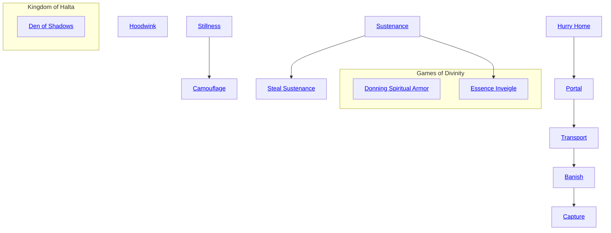

## Cunning Thief

Cost: 1 mote per 2 dice
Duration: Instant
Type: Simple
Minimum Temperance: 2
Minimum Essence: 1
Prerequisite Charms: None

The spirit must touch the target for this Charm to
work (resolved by a normal Dexterity + Brawl or Martial
Arts check). If the attempt to touch the target is successful,
make a reflexive Wits + Temperance roll. For every success
the spirit achieves, the target loses two motes of Essence.
The spirit cannot steal more motes than twice its Essence.

## Host of Spirits

Cost: 5 motes, 1 Willpower
Duration: One scene
Type: Simple
Minimum Temperance: 2
Minimum Essence: 2
Prerequisite Charms: None

Through the use of this Charm, the spirit forms mul-
tiple images of itself to deceive attackers. This ability works
much like Harrow the Mind, above. However, there are
more images and they are harder to distinguish from reality.
Make an Intelligence + Temperance roll for the spirit,
opposed by the target's Perception + Awareness. If the
target garners fewer successes than the spirit, he sees many
false images of the small god, each virtually indistinguishable
from the real being. Attacks by individuals so befuddled
have only (their Essence) in 10 chance of actually striking
the spirit. Make another Perception + Awareness for those
observing the spirit every time the spirit attacks.

## Hoodwink

Cost: 8 motes, 1 Willpower
Duration: Instant
Type: Reflexive
Minimum Temperance: 2
Minimum Essence: 1
Prerequisite Charms: None
This Charm allows the spirit to temporarily distract the
target, causing his attention to focus on something other
than the spirit. Roll the spirit's Manipulation + Conviction
with a difficulty equal to the target's Essence. Simple success
distracts the target for a turn - long enough for the spirit
to run away or dematerialize. Three or more extra successes
distract the target from anything it was thinking about the
spirit, such as suspicions, accusations, anger, etc. Five or
more extra successes means the target does not remember
the spirit until something or someone reminds him of what
he was thinking. This Charm requires extra successes to
distract a target who is feeling negative emotions toward the
spirit, and it requires at least three additional success to
affect someone in combat with it.

## Stillness

Cost: 3 motes
Duration: One scene
Type: Reflexive
Minimum Temperance: 1
Minimum Essence: 1
Prerequisite Charms: None

This Charm allows the spirit to remain absolutely,
perfectly still.

## Camouflage

Cost: 10 motes
Duration: One scene
Type: Simple
Minimum Temperance: 3
Minimum Essence: 2
Prerequisite Charms: [[#Stillness]]

This Charm allows the spirit to camouflage itself within
whatever environment it happens to be in. A spirit standing
against a rock takes on the coloration of that rock, and its
edges might soften a bit, making its outline difficult to make
out against the background. Roll the spirit's Wits + Temperance.
Successes on this roll are added to any successes on the
spirit's Dexterity + Stealth roll if it is attempting to actively
hide. The result is the number of successes observers' players
must roll on their Wits + Temperance checks (four net
successes are required if the spirit is still, three if it moves
slowly, two if it moves normally, and one if it moves quickly).

## Hurry Home

Cost: 10 motes, 1 Willpower
Duration: Instant
Type: Reflexive
Minimum Temperance: 2
Minimum Essence: 1
Prerequisite Charms: None

With a successful Wits + Temperance check, a spirit
may escape whatever situation it is in and return to its own
home — what exactly constitutes the spirit's home is a
matter for Storyteller discretion. The more tense and
hurried the situation, the more successes the spirit requires.
One success is all that's needed in a relaxed, quiet
setting. Five successes take the spirit home even in the
middle of a combat.

## Portal

Cost: 15 motes, 1 Willpower
Duration: One turn
Type: Simple
Minimum Temperance: 3
Minimum Essence: 3
Prerequisite Charms: [[#Hurry Home]]

A successful Intelligence + Temperance check allows
the spirit to open up a portal large enough for it to step
through. The portal lasts for one turn; during that time,
anyone else may step through it as long as they can fit
through the opening. With one success, the portal takes
the travelers to a random (though not immediately harmful)
location. With two successes, the spirit may loosely
direct the exit point (&quot;Southern Deserts, please&quot;) or go
directly to its home. Five or more successes allow the spirit
to direct the portal wherever it pleases. Extra successes
beyond the successes required for pinpointing the portal's
exit point allow the spirit to triple the radius of the portal.

## Transport

Cost: 20 motes, 1 Willpower
Duration: Instant
Type: Simple
Minimum Temperance: 4
Minimum Essence: 4
Prerequisite Charms: [[#Portal]]

A successful Dexterity + Temperance check allows
the spirit to transport itself wherever it chooses. For each
success, it may transport one passenger (willing or unwilling)
as well, though it costs one additional Willpower
point if there are passengers involved. All passengers must
be within the line of sight of the spirit. The spirit must have
been to the destination before.

## Banish

Cost: 10 motes, 1 Willpower per target
Duration: Instant
Type: Simple
Minimum Temperance: 4
Minimum Essence: 4
Prerequisite Charms: [[#Transport]]
With this Charm, a spirit may banish any targets
within line of site to a random habitable location up one.
mile distant (Le., a human would not be banished to an
underwater location or dumped in a lava flow). Roll the
spirit's Perception + Temperance. Each success allow one
target to be banished in this manner. The more successes
the farther away the target is likely to be sent. This Charm
must be used within the bounds of the spirits home
territory.

## Capture

Cost: 15 motes, 1 Will power per target
Duration: Instant
Type: Simple
Minimum Temperance: 5
Minimum Essence: 6
Prerequisite Charms: [[#Banish]]

With this Charm, a spirit may transport any targets
within line of site to a location of the spirit's choosing, as
long as it isn't immediately deadly to the target (the target
could be transported into a cage or into the cave of a
dangerous beast, but not into a lava flow or the bottom of
the ocean unless the target could survive those places).
Roll the spirit's Dexterity + Temperance. Each success
allows one target to be captured in this manner.

## Sustenance

Cost: 3 motes
Duration: Instant
Type: Simple
Minimum Temperance: 1
Minimum Essence: 1
Prerequisite Charms: None

The spirit must touch a mortal in order to activate his
Charm. This does not involve a Brawl or Martial Ats
check, as this Charm works only on a sleeping moral.
After the spirit touches the target, roll its Wits+ Temperance.
For each success, the spirit devours one mote of
Essence. This Charm always involves some other method
of sustenance as well. The spirit might feed on the dreams
and nightmares of the mortal, or on her breath. Whatever
the spirit feeds on does not harm the mortal, although it
might have mild (and temporary) effects when the mortal
wakes up. Even if the spirit does not regain the Essence it
spent, it still feels satiated from the other part of its meal.

## Steal Sustenance

Cost: 6 motes, 1 Willpower
Duration: Instant
Type: Simple
Minimum Essence: 2
Minimum Essence: 1
Prerequisite Charms: [[#Sustenance]]

The spirit must touch a sleeping mortal in order to
activate this Charm. Roll the spirit's Strength + Temperance.
At least two successes are required. Not only does this
Charm steal two motes of Essence per success, but it also
devours something that leaves the mortal impaired in some
way — hearing, sight, etc. — although it leaves the body
apparently unharmed. Only supernatural healing of some
sort restores the loss; it never heals normally. Even if the
spirit does not replenish the Essence it spent, it feels satiated.

## Donning Spiritual Armor

Cost: 5 Motes
Duration: One scene
Type: Simple
Minimum Temperance: 2
Minimum Essence: 2
Prerequisite Charms: None

The small god summons up the forces of the elements or
similar powers to protect it from harm. The spirit gains armor
equal to Temperance + Essence. This armor can be used to
soak any form of bashing or lethal damage, including damage
caused by environmental conditions such as excessive heat
or cold. Elementals and elementally associated spirits always
surround themselves with elemental protections such as a
hauberk of tough roots, a shirt of flexible rock or a breastplate
of living flame. Other spirits don armor of light or darkness
or, occasionally, transform their ordinary garb into supernally
beautiful and durable garments of pure magic.

## Essence Inveigle

Cost: 6 motes, 2 Willpower
Duration: One week (at least)
Type: Simple
Minimum Temperance: 3
Minimum Essence: 2
Prerequisite Charms: [[#Sustenance]]

The spirit has consensual sex with a mortal in order to
activate the Charm, so no Brawl or Martial Arts rolls are
required. Amidst the merriment, roll the spirit's Manipulation
+ Temperance. For each success, the spirit devours 1 mote of
Essence. What is more, the victim later develops an unquenchable
craving for another rendezvous with the spirit. If
the victim returns freely, the process is repeated (and any lost
Wits suffered from the process below are regained). If the
victim does not return within one week, roll his Wits +
Conviction -1 die for each time the spirit successfully used the
Charm against die victim. If the roll yields fewer successes that
the spirit's Willpower, the victim loses a point of Wits temporarily.
If he does not return to the spirit that day, repeat the
process the next day, continuing every day until the victim
either returns of his own volition, succeeds in breaking the
Charm or reaches 0 Wits (in which case the victim loses all
control and will do anything within his power to return to the
spirit). If the victim's Wits + Conviction roll succeeds against
the spirit s Willpower, the Charm is cancelled, and all temporary
Wits losses are regained. This Charm has no effect on
beings with an Essence higher than the spirit's.

## Den of Shadows

Cost: 5 motes
Duration: One day
Type: Simple
Minimum Temperance: 2
Minimum Essence: 2
Prerequisite Charms: None

The Shade Tiger possesses a unique Charm — it
can hide in any shadow for the duration of the day.
The Den of Shadows automatically disappears at
sunset (and the Tiger springs forth from its lair, ready
to hunt). While in the Den of Shadows, the Shade
Tiger is Elsewhere and is, therefore, unaware of any
happenings in the living world or the Underworld.
