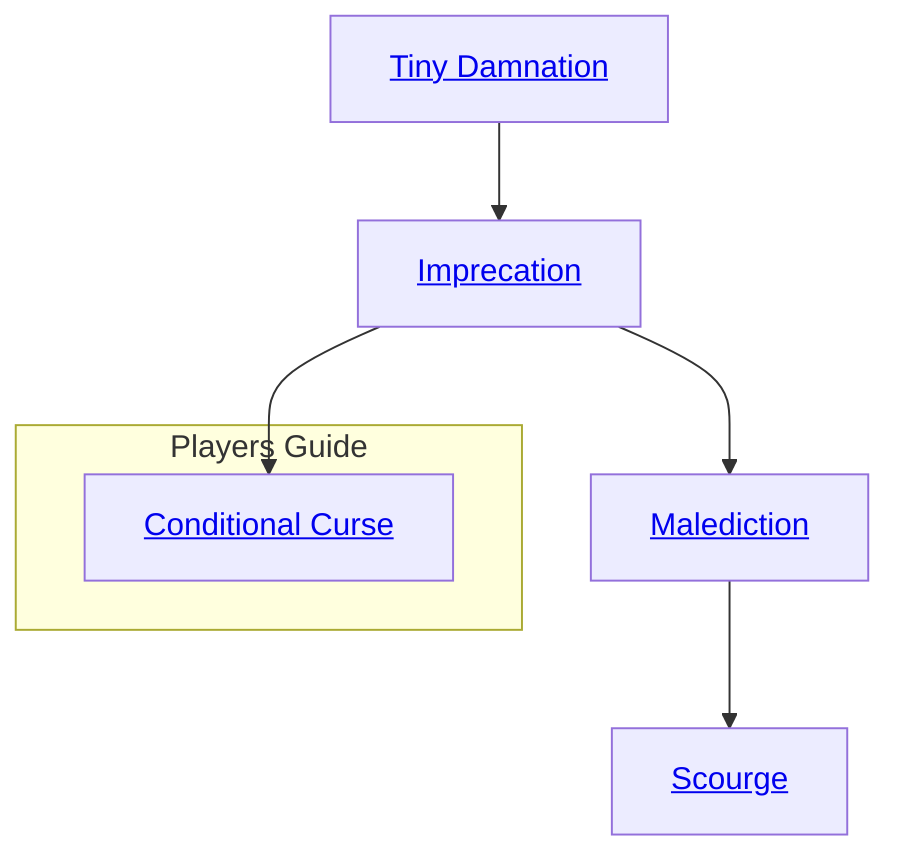

## Tiny Damnation

Cost: 5 motes
Duration: One day
Type: Simple
Minimum Valor: 1
Minimum Essence: 1
Prerequisite Charms: None

The effects of this Charm always fade by the next
morning's sunrise, and it may not be cast more than once
per day on the same target. Some possible curses:
• One dot lost from an Ability of the spirit's choosing.
• The loss of one temporary Willpower point.
• The loss of two motes of Essence.
• Bad luck: the target loses one die from any normal
Ability checks (not Charm checks) that relate to the way
in which the target offended the spirit.

## Imprecation

Cost: 10 motes
Duration: One week
Type: Simple
Minimum Valor: 1
Minimum Essence: 2
Prerequisite Charms: Tiny Damnation

The effects of this Charm last for one week, and it may
not be cast more than once per week on the same target.
Some possible curses:
• Loss of two Ability dots, distributed as the spirit sees fit.
• The loss of two temporary Willpower points.
• The loss of one Attribute dot of the spirit's choosing.
• The loss of five motes of Essence.
• Bad luck: the target removes one die from normal Ability checks (not Charm checks).
• A mark appears in an obvious place on the target
that only spirits or Exalted with some sort of supernatural
sight can see. This may, for example, urge any spirits who
meet the target to torment him.

## Malediction

Cost: 15 motes, 1 Willpower
Duration: One week
Type: Simple
Minimum Valor: 2
Minimum Essence: 4
Prerequisite Charms: Imprecation

The effects of this Charm last for one week, and it may
not be used on a target more than once every two weeks.
Some possible effects:
• Loss of four Ability points, distributed as the spirit
sees fit.
• Loss of two Attribute points, distributed as the spirit
sees fit.
• Loss of three temporary Willpower points.
• Loss of ten motes of Essence.
• Bad luck: the target removes one die from both
normal Ability checks and Charm checks.
• The effects of one Charm (of Virtue 1, Essence 1) that
the spirit possesses may be conferred upon the target, but that
effect is twisted in some way. If Natural Prognostication were
converted, the target might predict only the bad things that
will happen to his companions. Or his predictions might be
more than a little mixed up. Landscape Travel, if cast on
someone traveling through a forest, might force him to travel
through the trees and prevent him from ever touching the
ground. I his twisted Charm lasts tor no more than one week.

## Scourge

Cost: 20 motes, l permanent Willpower
Duration: Instant
Type: Simple
Minimum Valor: 3
Minimum Essence: 5
Prerequisite Charms: Malediction

This curse is never cast lightly, and it may not be cast
more than once per year. Only spirits that have been
drastically wronged in heinous ways would consider using
this curse (if just because they wouldn't be able to cast it
again for another year).
• Loss of one Attribute point, permanently. It must be
bought back up through practice (and experience points),
Against a mortal character, this Charm also permanently
lowers the character's maximum score in that Ability by one.
• Loss of two Ability points, permanently, distributed
as the spirit sees fit. Only practice and experience points
may buy this back up again.
• Loss of one permanent Willpower point.
• Loss of one permanent Essence point.
• Loss of all temporary Willpower.
• The effects of one Charm (maximum Virtue 2,
Essence 2) that the spirit possesses may be conferred upon
the target, but the effect is twisted in some way (as
Malediction). This lasts for twice as long as the Charm
would normally last. In rare cases (Storyteller discretion)
the effect may be permanent.
• Bad luck: the target attracts ill-intentioned spirits
wherever he goes. Duration permanent.
• The spirit may permanently change some physical
feature of the target, such as facial hair or eye color. (This
alteration may not change any Attributes by more than
one point.)

## Conditional Curse

Cost: 3 motes, 1 Willpower
Duration: Until Calibration
Type: Simple
Minimum Compassion/Valor: 2
Minimum Essence: 4
Prerequisite Charms: Benefaction or Imprecation

With these Charms, a spirit may place a mark of Essence
upon a target in its line of sight as a delayed trigger for another
Charm. If the delayed effect has a positive intent, the spirit
must know and use the Compassion Charm Conditional
Blessing. A negative or harmful intent requires the Valor
Charm Conditional Curse. A Manipulation + Compassion/
Valor roll against a difficulty of the target's Essence is neces-
sary to inscribe the mark. If this roll succeeds, the spirit
chooses one Charm it knows that can directly affect that
target. If the selected Charm has multiple uses or permuta-
tions, the spirit must also select the exact effects the Charm
will take. The spirit then establishes the precise actions the
target must perform to trigger the delayed Charm.
The spirit may include as many conditions as desired, any
of which may be as elaborate or straightforward as desired. For
example, the spirit may decide to heal a loyal shaman with
Touch of Grace if she speaks a specific prayer petitioning aid.
Conversely, a demon might arrange to summon its Demon-
Blooded daughter to a dungeon in Malfeas (via Capture) if
she ever disobeys a direct order or reveals her infernal heritage
to anyone she is not actively trying to kill.
Whenever the target of a Conditional Blessing or
Curse performs the requisite actions, the spirit knows. At
any time, it may then immediately activate the triggered
Charm as a reflexive action to end the Conditional Bless-
ing/Curse regardless of distance or withhold its benediction/
wrath until it can learn more about the target's actions.
This Charm and its mark also fade without effect if the
target does not meet the established conditions by the next
Calibration. Only spirits and other beings capable of
perceiving Essence at work can see the mark of an extant
Conditional Blessing/Curse.
