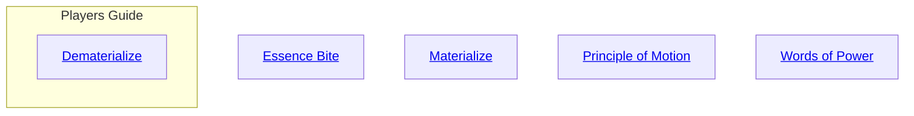
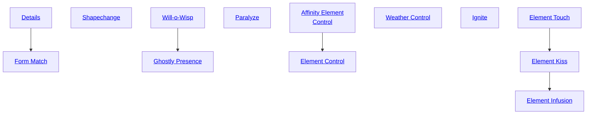
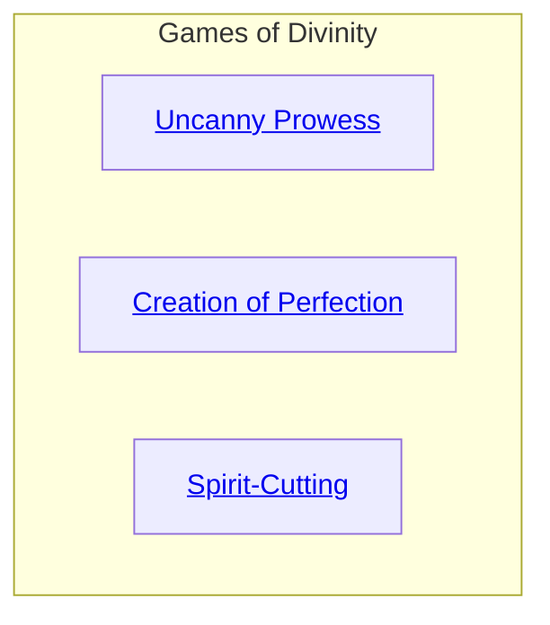

## Essence Bite

Cost: 3 motes
Duration: One scene
Type: Simple
Minimum Valor: 3
Minimum Essence: 2
Prerequisite Charms: None

The spirit must touch its target for this Charm to
work, requiring a successful Dexterity + Brawl or Martial
Arts roll. If the touch attempt is successful, make a
reflexive Valor + Essence roll for the spirit. For every
success on the attack, the spirit does a point of lethal
damage. The character's armor soak applies as normal to
this damage, and extra successes on the attack roll add to
damage as usual.
This Charm may rely on heat, cold, life-draining or
any number of other mechanisms to do damage —
almost all have secondary effects that the spirit can
manipulate to its advantage. For example, a ghost that
can start fires with its fiery touch can burn down a barn
with this Charm.

## Materialize

Cost: Varies
Duration: Indefinite
Type: Simple
Minimum Valor: 2
Minimum Essence: 2
Prerequisite Charms: None

Through the use of this Charm, the spirit can materialize
in the physical world. The cost of this Charm is between 50
percent and 100 percent of the spirit's temporary Essence.
The cost varies from spirit to spirit and is listed in the spirit's
description or assigned by the Storyteller. Generally, as the
power of the spirit grows, the spirit must expend proportionally
greater amounts of Essence to materialize.
In most cases, a spirit that plans to meddle in mortal
affairs will materialize in some safe area and then rest,
regaining its Essence, before it goes about its business. Spirits
that have not materialized cannot affect the physical world, not
with Charms, physical attacks or in any other fashion.

## Principle of Motion

Cost: 5 motes, 1 Willpower
Duration: Until used
Type: Extra Action
Minimum Valor: 2
Minimum Essence: 2
Prerequisite Charms: None

When the spirit uses this Charm, it gains a pool of extra
actions equal to its Valor. Actions in this pool can be expended
for extra attacks on the spirit's initiative or reflexively, to parry or
dodge an attack or to refresh the spirit's Dodge pool when using
the full dodge maneuver. If the spirit does not use all the actions
in its pool, they remain available for it in the following turn.
Actions in the pool will persist for many months, and many spirits
make sure they retain a full complement of actions in case they
are ambushed. A spirit cannot use this Charm again until it has
used up all the extra actions granted by the last use of the Charm.
While the spirit has extra actions in its pool, the motes of Essence
used to power this Charm are considered committed.

## Words of Power

Cost: 3 motes
Duration: One scene
Type: Simple
Minimum Valor: 2
Minimum Essence: 2
Prerequisite Charms: None

The spirit may intone blasphemies, keen out the lamentations
of the dead or speak the victim's true name, but
regardless, its words are like a battering ram. The spirit attacks
using Charisma + Valor to hit the opponent and does bashing
damage equal to the spirit's Strength, which can be soaked
only by the target's Stamina. Extra successes on the attack add
to damage, as usual. For every health level of damage the
target takes, he is at a - 1 penalty to all dice pools for a number
of turns equal to the attacking spirit's Essence.
This attack may be dodged or blocked as normal but
has no physical effects except perhaps causing blood to
flow from the target's ears or hurling him bodily through
light obstructions.

## Dematerialize

Cost: Varies
Duration: Indefinite
Type: Simple
inimum Valor: 2
inimum Essence: 2
Prerequisite Charms: None

Through the use of this Charm, an elemental may
transmute its flesh and personal belongings into spiritual
Essence, thereby assuming an incorporeal state. Dematerialized
elementals may perceive and interact with other
incorporeal beings as if both were solid, either magically or
with touch. However, immaterial beings are utterly undetectable
to physical beings and cannot directly affect the physical
world in any way without Charms or other powers intended
for such use (such as Possession, Will-o-Wisp etc.).
Dematerialized elementals with Essence 2+ can spend
1 mote to manifest for a scene as a translucent phantom of
themselves and speak in a quiet voice or whisper, exactly
as normally immaterial spirits can do as an innate ability.
As always, the Storyteller remains the final arbiter of
whether a particular power may affect the physical world
from a dematerialized state. This lack of physical interac-
tion also allows an incorporeal elemental to effortlessly
pass through solid walls and other material obstructions,
though appropriate magical wards can still bar their path
The cost of this Charm is normally between 50
percent and 100 percent of the elemental's total
available Essence pool. For elementals without a
listed cost to dematerialize, the percentage cost of
total Essence they must expend equals their (Essence
rating x 5) + 45, rounded up. For example, a spirit
with Essence 2 and an available pool of 48 motes pays
27 motes (55 percent).
Eclipse Caste Solars and Moonshadow Caste Abyssals
who learn this Charm also calculate their cost according to
the preceding formula without applying the usual double
cost modifier for learning spirit Charms, determining the
value according to a percentage of their total Essence pool
(Personal + Peripheral). The half-spirit descendents of
gods, elementals and demons do not pay a percentage of
their total pool, instead paying a cost of their (Essence
rating x 5) + 5 motes.
Unlike other Charms of non-instant duration, De-
materialize does not require that elementals commit the
Essence cost to sustain the magic. However, beings that
normally exist in a material state cannot regain Essence
through respiration while Dematerialized (and vice versa
for immaterial spirits who materialize). Instead of com-
mitting Essence, beings using this Charm must pay half
the normal cost each day at sunrise as a reflexive upkeep,
rounded up. Failure to pay this upkeep immediately ends
the effects of the Charm. Otherwise, characters must
spend a dice action reverting back to their natural state,
though success is automatic.
The rules printed here expand upon and supersede
those for the Materialize Charm in Exalted and apply in
reverse for that Charm.

## Details

Cost: 3 motes
Duration: One scene
Type: Reflexive
Minimum Valor: 2
Minimum Essence: 2
Prerequisite Charms: None

Spirits use the Details Charm to change small details of
their physical appearance, upon a successful Charisma +
Valor check. Each use of this Charm allows one discrete
detail to be changed. The size and complexity of the detail
depends on the number of successes the spirit achieves. One
or two successes allow a small detail to be changed: hair
length, the shape of the spirit's pupils. Three or four allow
the spirit to change larger details: the design of a dress, the
length of its limbs. Five or more successes allow the spirit to
create details from nothing: a bracelet where there was none.

## Form Match

Cost: 8 motes per day, 1 Willpower
Duration: Variable
Type: Reflexive
Minimum Valor: 2
Minimum Essence: 1
Prerequisite Charms: Details

The spirit may take on another's physical form upon a
successful Charisma + Valor check. This requires the spirit
to touch the being to be emulated, which may require a
successful Dexterity + Brawl or Martial Arts check, depending
on the circumstances. The spirit must pay in advance
and choose up front how many motes to spend; if it chooses
to break the Charm early, those motes are not recovered.
A very successful Perception + Awareness check may
see through the disguise. Four successes indicate that small
elements of the disguise seem wrong, while five or more
indicate that the shapechanging seems patently false.
Some spirits and Exalted may possess Charms designed to
see through such trickery.
Certain actions may allow someone to see through
such a disguise or may momentarily break through the
disguise; superstitions of various areas prescribe different
actions. Some of these are: looking at someone's reflection
in a fractured mirror, looking at someone through lenses
that have been soaked in a special herbal solution, blowing
ashes of certain types of wood into someone's face. Which
superstitions apply depends on the spirit. Some particularly
difficult &quot;rituals&quot; may break the disguise entirely.

## Shapechange

Cost: 12 motes per day
Duration: Variable
Type: Simple
Minimum Valor: 2
Minimum Essence: 2
Prerequisite Charms: None

The spirit may take on any physical form it wishes upon
a successful Charisma + Valor check; it must pay the cost for
the full duration in advance (if the spirit breaks the Charm
early, the extra motes are not recovered). After that, the
spirit must reactivate the Charm if it wishes to continue the
masquerade, making the Charisma + Valor check again.
The spirit must spend another 10 motes and a Willpower
point in advance (once per use of the Charm, not per day)
if it wishes its Abilities, Attributes, etc. to change with its
form. This latter restriction does not apply if the spirit has
a very limited number of forms and knows them very well.
The Shapechange Charm may be seen through in the
same manner as the Form Match Charm, above.

## Will-o-Wisp

Cost: 5 motes
Duration: One turn
Type: Simple
Minimum Valor: 2
Minimum Essence: 1
Prerequisite Charms: None

The spirit causes brief, somewhat muddled manifestations
of sound, smell, and light, such as a ball of light or
indistinct sounds of conversation. Roll the spirit's Manipulation
+ Valor. The more successes, the more noticeable these
manifestations are (louder, brighter) and the longer they may
last. This Charm may not be used in precise ways — no writing
words or making pictures in light; no speaking distinct phrases.

## Ghostly Presence

Cost: 8 motes
Duration: One scene
Type: Simple
Minimum Valor: 3
Minimum Essence: 1
Prerequisite Charms: Will-o-Wisp

The spirit may cause the same manifestations as Will-o-Wisp,
again making a Manipulation + Valor check. This
time, however, it may create distinct patterns. Ghostly
writing may be created. This Charm may be used to hold
a conversation with a target while the spirit is unmanifested.
The number of successes affects how distinct the manifestations
are, how precisely controlled they are, and just how
thoroughly the spirit may manipulate its medium. With
five successes, the spirit may paint simple scenes out of
light, sound and smell. These scenes may not be larger than
ten feet in any direction, and they are obvious to anyone
who is close enough to observe them.

## Paralyze

Cost: 6 motes
Duration: Instant
Type: Reflexive
Minimum Valor: 2
Minimum Essence: 1
Prerequisite Charms: None

Through the use of this Charm, spirits can paralyze
targets. It must touch its target for this Charm to work,
which may require a successful Dexterity + Brawl or
Martial Arts check. If the spirit successfully touches its
target, roll its Strength + Valor with a difficulty equal to
the target's Stamina. Every extra success the spirit achieves
causes the target to suffer a -2 penalty to all rolls involving
movement or agility for the rest of the scene.

## Affinity Element Control

Cost: 6 motes
Duration: One scene
Type: Simple
Minimum Valor: 2
Minimum Essence: 2
Prerequisite Charms: None

The spirit may use this Charm to affect whichever
element (s) it shares an affinity with. For example, a forest
spirit could affect Wood, and possibly Earth (Storyteller's
discretion). This allows spirits to cause or calm small floods
and rainstorms, twist a small torch into a raging inferno or
a delicate dance of firelight, create gusts of wind, open a
hole in the earth or twist tree limbs into manacles.
Roll the spirit's Manipulation + Valor. The number of
successes indicates how fine a level of control the spirit has
and how powerful an effect it can create. One success
allows a spirit to call forth a mild rain or light a campfire,
while three allow a spirit to cause a rainy day or build a
torch into a bonfire without any extra fuel. Five successes
might allow a spirit to create a phantom lover out of air
itself or instantly consume a large wooden structure in
flames. The spirit may manipulate a one-yard cube of an
element per point of Essence it possess. In the case of area
effects like rain, it could cause the effect in a five-meter
radius per permanent Essence point.

## Element Control

Cost: 10 motes, 1 Willpower
Duration: One scene
Type: Simple
Minimum Valor: 3
Minimum Essence: 3
Prerequisite Charms: Affinity Element Control
The same as Affinity Element Control, except that
the spirit can control any element, not just one to which
it is attuned.

## Weather Control

Cost: 10 motes
Duration: Instant
Type: Simple
Minimum Valor: 3
Minimum Essence: 2
Prerequisite Charms: Affinity Element Control

This Charm allows the spirit to control the weather.
Note that this may duplicate some effects of the Element
Control Charms, but its effects are limited to weather
phenomena: rain, fog, floods, storms, heat, cold, etc. This
charm affects a larger area as well — a one- mile radius per
permanent Essence point. Roll the spirit's Manipulation +
Valor; the number of successes determines the size of the
effect the spirit can create, and the length of time before the
area's natural climate reasserts itself. One success allows
small changes — a low wind could be created, or a heavy
wind could be downgraded to a moderate wind. Three
successes allow the creation of a moderate rainstorm or a
mild heat wave. Five successes allow wild changes in local
weather patterns, such as high heat in the middle of the
month of Ascending Water. It takes one hour per success
for the local weather patterns to reassert themselves. Unnatural
or one-time meteorological effects that are halted by
the use of this Charm can be considered ended.

## Ignite

Cost: 1 or 5 motes
Duration: Instant
Type: Reflexive
Minimum Valor: 2
Minimum Essence: 2
Prerequisite Charms: None
The spirit may, upon a successful Stamina + Valor
check, set fire to whatever item it touches. This requires 5
motes if the item is nonflammable.

## Element Touch

Cost: 10 motes, 1 Willpower
Duration: One day
Type: Reflexive
Minimum Valor: 2
Minimum Essence: 2
Prerequisite Charms: None

This Charm causes its target to become &quot;touched&quot; by
the spirit's element. The spirit must touch its target for this
Charm to work, possibly requiring a successful Dexterity +
Brawl or Martial Arts attack. Roll the spirit's Manipulation
+ Valor with a difficulty equal to the target's Essence.
The more extra successes, the more intense the target's
reaction to this Charm. A Fire-aspected spirit causes
someone to grow feverish. The target might take on some
of the personality traits associated with fire: a hotheaded
temper, lusty libido, curiosity, anger, vengeance, forceful-
ness or willfulness. The effects of this Charm last for one
day or until the spirit chooses to release the target, whichever
comes sooner. This Charm is a favorite among demons,
who use it to bring out the worst in targets.

## Element Kiss

Cost: 20 motes, 1 Willpower
Duration: One week
Type: Reflexive
Minimum Valor: 2
Minimum Essence: 2
Prerequisite Charms: Element Touch

This Charm is the same as Element Touch, but it lasts
for one week or until the spirit chooses to release the target,
whichever comes sooner. Like Element Touch, this Charm
requires the spirit to touch its target. If the spirit achieves
three or more successes, the target may have hallucinations
that support and intensify his reaction.

## Element Infusion

Cost: 30 motes, 2 Willpower
Duration: One month
Type: Reflexive
Minimum Valor: 3
Minimum Essence: 3
Prerequisite Charms: Element Kiss

This Charm is similar to the lesser Element Kiss and
Element Touch Charms, but lasts for one month or until
the spirit chooses to release the target (whichever comes
sooner). Like the two lesser Charms, the spirit must either
touch the target or look into the target's eyes. Roll the
spirit's Manipulation + Valor with a difficulty equal to the
target's Essence. With two or more successes, the target has
the hallucinations described under Element Kiss. At three
or more successes, the target may well harm herself under
the force of her reaction.

## Uncanny Prowess

Cost: 2 motes
Duration: Special
Type: Reflexive
Minimum Valor: 2
Minimum Essence: 1
Prerequisite Charms: None

The spirit may add a number of dice equal to its Valor
score to a single Dexterity roll. This roll could be anything
from a single blow with a weapon to a single performance or
even to the roll to create a single piece of fine jewelry. When
used for longer endeavors, this Charm adds dice to each roll
of a single extended action. However, it can only be used on
one endeavor at a time, the Essence invested in this Charm
cannot be regained, and the Charm cannot he recast until
the task has been completed or abandoned.

## Creation of Perfection

Cost: 2 motes
Duration: Special
Type: Simple
Minimum Valor: 2
Minimum Essence: 2
Prerequisite Charms: None

This Charm allows spirits to create supernaturally exquisite
items or to perform feats of inhuman skill with various crafts.
When using this charm, roll Intelligence + Valor for the spirit.
Every success gained on this roll can be added to a single Craft,
Medicine, Occult or Larceny roll designed to create an item or to
carry out a slow and careful process such as performing surgery,
compounding a drug, putting on a disguise or creating a magical
talisman. This Charm cannot be used to enhance any task that
requires speed or haste such as picking a lock before the guard
arrives, stopping someone from bleeding to death or any form of
combat. It can also only be used on tasks that require both clear
thought and nimble fingers. No activity can simultaneously
benefit from both this Charm and the Uncanny Prowess Charm.

## Spirit-Cutting

Cost: 1 mote
Duration: Instant
Type: Supplemental
Minimum Valor: 3
Minimum Essence: 2
Prerequisite Charms: None

This Charm allows a materialized spirit to launch a
single attack at an unmanifested spirit. For the purposes of
the individual attack, the small god attacks the immaterial
spirit normally.
