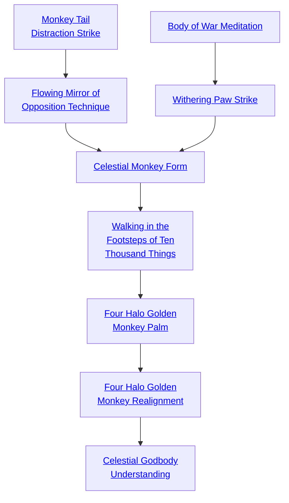

## Monkey Tail Distraction Strike

Cost: 2 motes
Duration: Instant
Type: Simple
Minimum Martial Arts: 2
Minimum Essence: 1
Prerequisite Charms: None

With this Charm, the Exalt is able to move from a
perfectly relaxed, unassuming pose to strike her opponent,
effectively ambushing him with a surprise attack while in
full view. The martial artist must not be in combat with her
opponent in order for this Charm to be effective. After
activating this Charm, the opponent's player makes a reflexive
Perception + Awareness roll for his character, with
a difficulty equal to the martial artist's permanent Essence.
If this roll fails, the Exalt's opponent cannot dodge or
parry this attack without the use of Charms. If it succeeds,
the opponent is not taken completely off guard and can
dodge or parry as normal but cannot attack until he enters
into combat turns with the martial artist. Charms such as
Surprise Anticipation Method can negate the effects of
this Charm if they are active or if they are reflexive and the
target chooses to activate them.

## Flowing Mirror of Opposition Technique

Cost: 1 mote
Duration: Instant
Type: Reflexive
Minimum Martial Arts: 2
Minimum Essence: 1
Prerequisite Charms: Monkey Tail Distraction Strike

Also known as the &quot;Monkey Dance,&quot; this Charm
enables the martial artist using it to be frustratingly hard to
attack. The Exalt flashes forward, engaging his opponent
and &quot;dances&quot; about her, inside the attack range of her
Melee, Martial Arts or Brawl weapon, thereby nullifying
its speed and accuracy bonuses. Also, being in such close
range allows the Exalt to make quicker attacks. Add his
permanent Essence score to his Initiative pool.

## Body of War Meditation

Cost: 4 motes per point of Strength or Stamina, 6 motes per point of Dexterity
Duration: One scene
Type: Simple
Minimum Martial Arts: 3
Minimum Essence: 2
Prerequisite Charms: None

The Exalt begins a meditative prana that takes about
20 minutes to complete. In that time, the martial artist
channels powerful Essence through his form. His muscles
are imbued with a liquid suppleness, and his bones and skin
are fortified with an oaken flexibility. For every 4 motes of
Essence the martial artist spends, add 1 to his Strength or
Stamina. For every 6 motes of Essence, add 1 to his
Dexterity. Body of War Meditation can be used more than
once, the effects are cumulative, and the Exalt's Attributes
can be raised above Trait maximums. The character cannot,
however, raise any of his Physical Attributes by more
dots than he has in his permanent Essence rating, regardless
of how many times he uses this Charm.

## Withering Paw Strike

Cost: 4 motes, 1 Willpower
Duration: Instant
Type: Simple
Minimum Martial Arts: 3
Minimum Essence: 2
Prerequisite Charms: Body of War Meditation

Instead of extending himself to strike his opponent's
body, the martial artist makes an attack against his foe's
weapon arm in an attempt to disarm him. The Exalt makes
a Dexterity + Martial Arts attack that does no damage at
a difficulty of 1. The target may dodge or parry as if it were
a normal attack but with a base difficulty equal to the
attacking Exalt's Essence.
If the disarming roll is successful, the target's player
must make a reflexive roll of Wits + the combat Ability
governing the weapon the character is using. If she does
not gain as many successes on the Wits + Ability roll as the
martial artist had successes on the disarming roll, her
character is successfully disarmed and her weapon is flung
a number of feet in a direction of the martial artist's
choosing equal to (the martial artist's extra successes × 10),
or the Exalt may take it for himself.

## Celestial Monkey Form

Cost: 5 motes
Duration: One scene
Type: Simple
Minimum Martial Arts: 4
Minimum Essence: 2
Prerequisite Charms: Flowing Mirror of Opposition, Withering Paw Strike

The disciples of this style practice a state of being
known as &quot;Selfless Mind.&quot; Through diligent, introspective
meditation, they learn to divorce themselves of
emotions or other distractions that would keep them
from their set course of action. This form is the perfect
expression of that ability.
The martial artist takes a moment to center himself
and spends the motes of Essence to fuel the Charm. His
body relaxes as he releases his mind from the burden of
emotions and social mores and taboos. Transcended, a
contented smile piques the corners of the martial artist's
mouth. It is from the display of this Charm that martial
artists of this style have come to be known also as
&quot;Blissful Sages.&quot; For the remainder of the scene, the
Exalt does not need to make Virtues tests. Slavering
hordes of the walking dead will not keep him from the
field, nor will a burning house of innocents distract him
from pursuing his adversary.
Characters cannot use more than one Form-type
Charm at a time. Using a Form-type Charm ends the
effects of any other Form-type Charm the character
was utilizing.

## Walking in the Footsteps of Ten Thousand Things

Cost: 10 motes, 1 Willpower, 2 Experience Points
Duration: Instant
Type: Simple
Minimum Martial Arts: 5
Minimum Essence: 3
Prerequisite Charms: Celestial Monkey Form

The masters who discovered and developed martial
arts obtained the principles of their fighting styles through
meditation on the world around them: the graceful dance
of wind through an orchard, the stoic fortitude of mountains,
the ferocious and cunning strength of a pack of
lionesses taking down a yeddim. It is also said that these
masters were completely unassailable. No technique could
defeat them. So diligent were they in their meditations,
they had walked in the footsteps of no less than ten
thousand things. The very principles of Creation were
known to them, and there was not a fighting style of sword
or fist that could remain inscrutable to them. It is on this
principle that this Charm is based.
The martial artist takes a moment to size up his
opponent, either by fighting her, by watching her demonstrate
her style or by watching her fight someone else. The
Exalt's player makes a Perception + Martial Arts roll with
a difficulty equal to his opponent's Martial Arts Ability. If
successful, he may add any successes over and above the set
difficulty to his Martial Arts attacks against that opponent
when she uses the scrutinized fighting style.
For each turn the Exalt studies his opponent and
spends the Essence for this Charm, the difficulty drops by
1, to minimum of difficulty 3. The martial artist can meaningfully
scrutinize his opponent for a maximum number of
turns equal to his Essence, and these turns do not have to
be consecutive ones. Once all the character's turns are
exhausted, he gains nothing by observing her again until
he increases his Essence. The successes on multiple rolls
are not cumulative. Only the highest number of successes
on a single roll may be kept.
The experience points spent for this Charm are spent
only once, no matter how many times the player of martial
artist invoking this Charm makes the Perception + Martial
Arts roll against his character's opponent.

## Four Halo Golden Monkey Palm

Cost: 3 motes, 1 Willpower
Duration: Instant
Type: Supplemental
Minimum Martial Arts: 5
Minimum Essence: 3
Prerequisite Charms: Walking in the Footsteps of Ten Thousand Things

The fact that Essence flows through all things and
that martial arts is a way to channel and direct these
energies is a fundamental principle understood by all
martial artists. Disciples of the Celestial Monkey Style
have refined this understanding to an exquisite degree.
As Essence flows through the land, there are places
where these flows convene, nexus points known as
Demesnes. Such nexus points exist in the body as well.
These places of convergence, of which there are four,
are known as the Gates of Virtue. Sages of the Celestial
Monkey Style believe that each of these gates is attuned
to one of the Divine Virtues. They are: the Crown of
Temperance (head), the Chalice of Compassion (sternum),
the Throne of Conviction (stomach) and the
Root of Valor (groin). In combat, as the martial artist
invokes this Charm, four Essence-laden rings encircle
these locations on his opponent, glowing at various
intensities corresponding to how &quot;firmly seated&quot; she is
in each of her Virtues.
The martial artist then makes an attack against one of
these Gates at a +3 difficulty. If successful, roll damage as
usual. If any damage exceeds his opponent's soak, his
opponent takes an additional amount of lethal damage
equal to the Virtue that corresponds to the location in
which she was struck.
For Example: Omun Dos, a mighty Lunar Celestial
Monkey, apes and cavorts around a highly angered and
frustrated Terrestrial Exalt of the Wyld Hunt trying to
kill him. Omun Dos opens his mind and perceives the
young Exalt's four Gates of Virtue and sees that his
opponent is highly centered in her Root of Valor.
Omun Dos punches her and succeeds in getting two
levels of damage over his opponent's considerable soak.
The young Exalt has a Valor of 5. As such, she takes an
additional five levels of lethal damage and drops squeal-
ing to her knees.

## Four Halo Golden Monkey Realignment

Cost: 8 motes, 1 Willpower
Duration: One scene
Type: Reflexive
Minimum Martial Arts: 5
Minimum Essence: 3
Prerequisite Charms: Four Halo Golden Monkey Palm

With this Charm, the martial artist is able manipulate
his own Gates of Virtue with virtuosity. They no
longer remain stationary within his body. Instead, he is
able to move these nexus points about within his own
form. Doing so creates strange, spherical fields of Essence,
with a radius about the length of a man's forearm,
around his body wherever he moves the gates. This
causes no harm to the martial artist. However, those
witnessing him using this Charm will see glittering
coronas in the color and appearance of the Exalt's
anima banner flare around the Exalt's extremities as he
manipulates these spherical fields.
The martial artist is able to utilize these Essence fields
to parry any incoming attack, hand-to-hand or ranged,
using his full Dexterity + Martial Arts pool for the scene.
He does not have to be able to move to do this. In fact, the
Blissful Sage need not get up from the lotus-position he was
sitting in before these unfortunate, misguided fools tried to
disturb his meditations.
Also, for the scene, the martial artist may add his
permanent Essence to all Martial Arts attacks.

## Celestial Godbody Understanding

Cost: None
Duration: Permanent
Type: Special
Minimum Martial Arts: 5
Minimum Essence: 4
Prerequisite Charms: Four Halo Golden Monkey Realignment

Masters of the Celestial Monkey Style are so acutely
aware of how they move through Creation — or, more
importantly, how Essence moves through them and the
world around them while they move through Creation —
they can fortify, enrich and empower their actions just by
attuning themselves to the world around them. After
buying this Charm, the martial artist can treat all unaided
attacks and attacks he makes with any Charms of this style
as unarmed attacks, no matter what weapon he uses. All
Strength, Dexterity or Martial Arts minimums required
for the use of weapons are halved, rounded up. Also,
wearing armor no longer hinders his ability to perform this
martial-arts style. This Charm has no costs. It is simply an
enhancement of the Exalt's capabilities.
