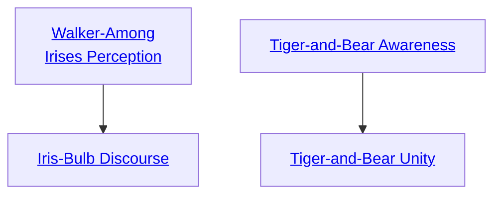

## Walker-Among Irises Perception

Cost: 5 motes
Duration: One scene
Type: Simple
Minimum Martial Arts: 3
Minimum Essence: 2
Prerequisite Charms: None

This Charm functions exactly like the Immaculate
Spirit Mastery Charm Spirit Sight. However,
when the martial artist using this Charm perceives
spirits, instead of seeing their true form, she perceives
an outline of the spirit's form, a god-shaped cutout
through which she beholds a field teeming with blossoming
irises by the thousands.

## Iris-Bulb Discourse

Cost: 5 motes, 1 Willpower
Duration: One scene
Type: Reflexive
Minimum Martial Arts: 3
Minimum Essence: 3
Prerequisite Charms: [[#Walker-Among Irises Perception]]

This Charm works exactly like the Immaculate Martial
Arts Charm Spirit Walking. However, because this
style lacks the ritualized diplomacy of the Dragon styles, a
casual, &quot;off the books&quot; attitude flavors the Exalt's dealings
with the little gods.
Martial artists using this style can be recognized as
such by the large foot-wide irises that burst from whatever
surface the Exalt is standing on (stone balcony,
pool of water, air, etc) and blossom for a few moments
before dissipating into a glittering cloud of purple-black
Essence. There are other differences besides the obvious
cosmetic effects.
Little gods who interact with the Terrestrial do so
completely without the protection of Heaven. Though
their murder may be avenged, Heaven turns a blind eye to
slights against propriety inflicted by the Exalt while this
Charm is in effect. The Exalt treats dematerialized spirits
as if they were material for the remainder of the scene. The
character may be hit by dematerialized beings and cannot
necessarily see any spirits she may encounter without the
use Walker-Among-Irises Perception.
In addition, during the duration of this Charm, if the
Exalt's Essence is higher than the spirit's, all difficulties for
the little god's Social rolls against the Terrestrial Exalt are
increased by the difference in their permanent Essence
ratings. This also applies in reverse — Exalts using this
Charm on powerful deities may not enjoy what the deities
say to them and suffer a similar penalty when interacting
with gods whose Essence in higher than their own.

## Tiger-and-Bear Awareness

Cost: 6 motes
Duration: One scene
Type: Reflexive
Minimum Martial Arts: 3
Minimum Essence: 3
Prerequisite Charms: None

The character becomes totally aware of the world
around him, breathing in an awareness of his surroundings
with the Essence of his respiration. No being that is
not using Essence to conceal itself can hide from him
within a radius equal to his Essence in yards. In addition,
the character also benefits from the effects of a danger
sense. Characters who possess this Charm can activate it
reflexively when subject to a sneak attack to obviate the
need for an ambush roll (see Exalted, p. 236 for rules on
ambushes). This Charm does not grant the character the
ability to see dematerialized spirits.

## Tiger-and-Bear Unity

Cost: 4 motes, 1 Willpower
Duration: Instant
Type: Supplemental
Minimum Martial Arts: 4
Minimum Essence: 3
Prerequisite Charms: [[#Tiger-and-Bear Awareness]]

The character's awareness of his environment allows
him to strike true against even the hardiest foes.
Characters who have mastered this technique can damage
any foe they can hit. Essence for this Charm must be
spent before the attack roll is made. After the attack is
rolled but before any defenses are applied, the player may
add his character's Martial Arts to the number of successes
rolled on the attack. This Charm does not allow
the character to damage individuals he cannot successfully
strike with an attack. The character cannot attack
dematerialized beings, for example, or beings who are for
some reason immune to attack.
