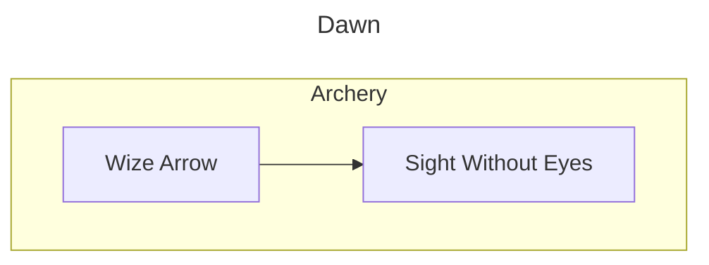

# Solar Charms

```mermaid
---
title: Dawn
---
flowchart LR

    subgraph Archery
        direction LR
        wize_arrow --> sight_without_eyes

        wize_arrow[Wize Arrow]
        click wize_arrow callback "
        Cost: 1 mote per die<br>
        Duration: Instant<br>
        Type: Supplemental<br>
        Minimum Archery: 1<br>
        Minimum Essence: 1<br>
        Prerequisite Charms: None<br>
        <br>
        The character extends her anima into the world around
        her, and joins archer, target and arrow into a single being. Truly,
        the arrow knows the way to the target, for that is its natural
        home. For each mote of Essence the player spends, he may add
        1 die to an Archery attack roll, but the number of bonus dice
        added to any single roll cannot exceed her normal Dexterity +
        Archery dice pool. The player must declare how much Essence
        she is going to use in this Charm prior to making the attack roll."

        sight_without_eyes[Sight Without Eyes]
        click sight_without_eyes callback "Cost: 1 mote per die<br>
        Duration: Instant<br>
        Type: Supplemental<br>
        Minimum Archery: 3<br>
        Minimum Essence: 1<br>
        Prerequisite Charms: Wize Arrow<br>
        <br>
        The character opens her eyes not to the visual world,
        but to the world of Essence and senses her target in that
        fashion. She may make an Archery attack without penalty
        for visual conditions. Other negative modifiers (high winds,
        range and so forth) still impose their regular penalties.
        "
        
    end
    
```
